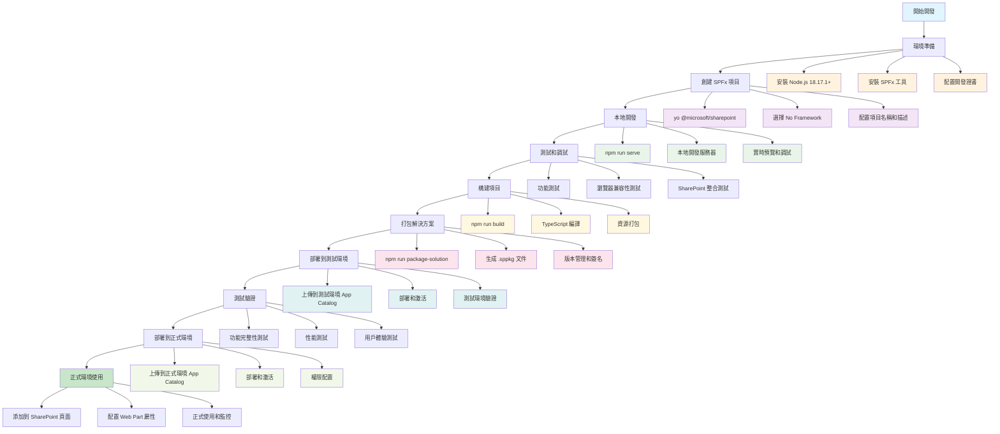

# 學生成績顯示 Web Part

這是一個使用SharePoint Framework (SPFx) 開發的學生成績顯示Web Part，使用純JavaScript/TypeScript實現，無需額外的框架依賴。

## 為什麼選擇 SPFx 而不是 Embedded Code？

### 🚀 **技術優勢**
- **現代化開發體驗**：使用 TypeScript、ES6+ 語法，支持模組化開發
- **工具鏈完整**：內建 Webpack、Gulp、ESLint 等現代前端工具
- **類型安全**：TypeScript 提供完整的類型檢查和智能提示
- **熱重載開發**：本地開發時支持即時預覽和熱重載

### 🏗️ **架構優勢**
- **組件化設計**：可重用的 Web Part 組件，便於維護和擴展
- **生命週期管理**：完整的組件生命週期，包括初始化、渲染、更新、銷毀
- **狀態管理**：內建的狀態管理機制，便於處理複雜的數據流
- **主題支持**：原生支持 SharePoint 主題系統，自動適配淺色/深色模式

### 🔒 **安全性和合規性**
- **沙箱環境**：運行在 SharePoint 的安全沙箱中，避免 XSS 攻擊
- **權限控制**：與 SharePoint 權限系統深度整合
- **企業合規**：符合企業級安全標準，支持審計和監控
- **CSP 兼容**：完全兼容 Content Security Policy

### 📱 **用戶體驗**
- **響應式設計**：自動適配各種設備和屏幕尺寸
- **無縫整合**：與 SharePoint 界面完全融合，用戶無需學習新操作
- **性能優化**：內建性能優化，包括代碼分割、懶加載等
- **可訪問性**：支持屏幕閱讀器和鍵盤導航

### 🛠️ **維護和部署**
- **版本控制**：支持版本管理和回滾
- **集中部署**：通過 SharePoint App Catalog 集中部署和管理
- **環境一致性**：開發、測試、生產環境的一致性
- **文檔完整**：Microsoft 官方支持和完整的文檔

### ❌ **Embedded Code 的局限性**
- **維護困難**：代碼分散在多個頁面，難以統一管理
- **安全風險**：容易引入 XSS 漏洞和安全問題
- **性能問題**：缺乏優化，可能影響頁面加載速度
- **兼容性差**：不同瀏覽器和 SharePoint 版本的兼容性問題
- **擴展性差**：難以實現複雜的組件和功能
- **調試困難**：缺乏現代開發工具支持

### ⚠️ **Microsoft 官方警告**
根據 Microsoft 官方文檔，Embedded Code 只是**臨時解決方案**，不建議在生產環境中使用：

> **"Embedded code is a temporary solution and should not be used in production environments."**

#### 🔄 **自動重置機制**
- **24小時重置**：SharePoint 每24小時會自動重置 "Allow JavaScript embedded" 設定
- **不穩定性**：這意味著 embedded code 可能隨時失效，影響業務連續性
- **維護成本高**：需要定期重新啟用和檢查功能

#### 📚 **官方文檔參考**
- [SharePoint Framework overview](https://docs.microsoft.com/en-us/sharepoint/dev/spfx/sharepoint-framework-overview)
- [Client-side web parts](https://docs.microsoft.com/en-us/sharepoint/dev/spfx/web-parts/overview-client-side-web-parts)
- [Modern SharePoint development](https://docs.microsoft.com/en-us/sharepoint/dev/modern-development/sharepoint-modern-experience)

#### 🎯 **Microsoft 推薦**
Microsoft 強烈建議使用 SharePoint Framework (SPFx) 作為現代 SharePoint 開發的標準方式，因為它提供了：
- 長期穩定性
- 企業級安全性
- 完整的開發工具鏈
- 官方支持和維護

## 功能特點

- 📊 **動態成績表格** - 顯示學生的完整成績信息
- 🔍 **搜索功能** - 按學生姓名或學號搜索
- 🎯 **科目篩選** - 按科目篩選（80分以上）
- 📈 **統計分析** - 實時計算總學生數、平均分、最高分、最低分
- 📥 **數據導出** - 支持CSV格式導出
- 📱 **響應式設計** - 適配各種屏幕尺寸
- 🌙 **主題支持** - 支持淺色和深色主題
- 🎨 **現代化UI** - 使用Office UI Fabric設計語言

## 技術棧

- SharePoint Framework (SPFx)
- TypeScript
- SCSS/CSS Modules
- 純JavaScript DOM操作

## 開發環境要求

- Node.js 18.17.1 或更高版本
- npm 9.6.7 或更高版本
- SharePoint Framework Yeoman生成器

## SPFx 開發到部署完整流程



## 詳細步驟說明

### 1. **環境準備**
```bash
# 安裝 Node.js 18.17.1 或更高版本
nvm install 18.17.1
nvm use 18.17.1

# 安裝 SPFx 工具
npm install -g @microsoft/generator-sharepoint
npm install -g yo

# 配置開發證書
npx gulp trust-dev-cert
```

### 2. **創建 SPFx 項目**
```bash
# 創建新項目
yo @microsoft/sharepoint

# 選擇配置：
# - 項目名稱：student-grades-spfx
# - 框架：No Framework
# - 描述：學生成績顯示 Web Part
```

### 3. **本地開發**
```bash
# 安裝依賴
npm install

# 啟動開發服務器
npm run serve

# 瀏覽器訪問：https://localhost:4321
```

### 4. **測試和調試**
- 功能測試：確保所有功能正常運作
- 瀏覽器測試：Chrome、Edge、Firefox 兼容性
- SharePoint 整合測試：權限、數據讀取等

### 5. **構建項目**
```bash
# 構建項目
npm run build

# 檢查構建結果
# 確保沒有 TypeScript 錯誤
# 確保所有資源正確打包
```

### 6. **打包解決方案**
```bash
# 打包解決方案
npm run package-solution

# 生成文件：
# - student-grades-spfx.sppkg
# - 部署說明文檔
```

### 7. **部署到測試環境**
1. 上傳 `.sppkg` 文件到測試環境 App Catalog
2. 部署和激活解決方案
3. 在測試頁面添加 Web Part
4. 進行全面測試

### 8. **測試驗證**
- 功能完整性測試
- 性能測試（載入速度、響應時間）
- 用戶體驗測試
- 錯誤處理測試

### 9. **部署到正式環境**
1. 上傳 `.sppkg` 文件到正式環境 App Catalog
2. 部署和激活解決方案
3. 配置適當的權限

### 10. **正式環境使用**
1. 在 SharePoint 頁面添加 Web Part
2. 配置 Web Part 屬性（Excel 文件路徑等）
3. 監控使用情況和性能
4. 收集用戶反饋

## 部署檢查清單

- [ ] 開發環境測試通過
- [ ] 構建無錯誤
- [ ] 打包成功
- [ ] 測試環境部署成功
- [ ] 功能驗證完成
- [ ] 正式環境部署成功
- [ ] 權限配置正確
- [ ] 用戶培訓完成
- [ ] 監控和維護計劃就緒

## 數據結構

Web Part使用以下學生數據結構：

```typescript
interface Student {
  studentId: string;    // 學號
  name: string;         // 姓名
  chinese: number;      // 中文成績
  english: number;      // 英文成績
  math: number;         // 數學成績
  science: number;      // 科學成績
  total: number;        // 總分
  average: number;      // 平均分
}
```

## 模擬數據

目前使用模擬數據，包含10個學生的完整成績信息：

- 張小明 (S001) - 中文:85, 英文:92, 數學:88, 科學:90
- 李小華 (S002) - 中文:78, 英文:85, 數學:92, 科學:87
- 王小美 (S003) - 中文:92, 英文:88, 數學:85, 科學:94
- 陳小強 (S004) - 中文:80, 英文:90, 數學:95, 科學:82
- 林小芳 (S005) - 中文:88, 英文:85, 數學:90, 科學:88
- 黃小偉 (S006) - 中文:75, 英文:92, 數學:87, 科學:90
- 劉小玲 (S007) - 中文:90, 英文:88, 數學:93, 科學:85
- 吳小傑 (S008) - 中文:82, 英文:85, 數學:88, 科學:92
- 趙小雅 (S009) - 中文:95, 英文:90, 數學:89, 科學:91
- 孫小龍 (S010) - 中文:87, 英文:93, 數學:91, 科學:89

## 功能說明

### 搜索功能
- 在搜索框中輸入學生姓名或學號
- 支持實時搜索，無需點擊按鈕
- 搜索結果會即時更新表格和統計信息

### 科目篩選
- 選擇特定科目（中文、英文、數學、科學）
- 只顯示該科目成績80分以上的學生
- 可以與搜索功能組合使用

### 統計信息
- **總學生數** - 當前顯示的學生數量
- **平均分數** - 當前學生的平均分數
- **最高分數** - 當前學生中的最高平均分
- **最低分數** - 當前學生中的最低平均分

### 數據導出
- 點擊"匯出 CSV"按鈕
- 自動下載包含當前篩選結果的CSV文件
- 文件名格式：`student_grades.csv`

## 部署到SharePoint

### 方法1: 開發環境部署
1. 運行 `npm run serve`
2. 在SharePoint頁面中添加Web Part
3. 配置適當的權限

### 方法2: 生產環境部署
1. 運行 `npm run package-solution`
2. 將生成的 `.sppkg` 文件上傳到SharePoint App Catalog
3. 在SharePoint頁面中添加Web Part

## 自定義配置

### 修改模擬數據
在 `ScoreDisplayWebPart.ts` 文件的 `_loadStudentData()` 方法中修改學生數據：

```typescript
this.students = [
  // 添加或修改學生數據
  { studentId: 'S011', name: '新學生', chinese: 90, english: 85, math: 88, science: 92, total: 355, average: 88.75 },
  // ...
];
```

### 連接真實數據源
將 `_loadStudentData()` 方法中的模擬數據替換為SharePoint API調用：

```typescript
private async _loadStudentData(): Promise<void> {
  try {
    const response = await this.context.spHttpClient.get(
      `${this.context.pageContext.web.absoluteUrl}/_api/web/lists/getbytitle('StudentGrades')/items`,
      SPHttpClient.configurations.v1
    );
    const data = await response.json();
    this.students = data.value.map(item => ({
      studentId: item.StudentID,
      name: item.Name,
      chinese: item.Chinese,
      english: item.English,
      math: item.Math,
      science: item.Science,
      total: item.Total,
      average: item.Average
    }));
  } catch (error) {
    console.error('Error loading student data:', error);
  }
}
```

## 樣式自定義

Web Part使用CSS Modules，樣式文件位於：
- `ScoreDisplayWebPart.module.scss` - 主要樣式文件

支持的主題變體：
- 淺色主題（默認）
- 深色主題（自動適配）

## 故障排除

### 常見問題
1. **Web Part不顯示** - 檢查瀏覽器控制台錯誤
2. **樣式問題** - 確保CSS Modules正確編譯
3. **數據不載入** - 檢查模擬數據或API調用
4. **搜索不工作** - 檢查事件監聽器設置

### 調試技巧
- 使用瀏覽器開發者工具檢查DOM結構
- 查看控制台錯誤信息
- 檢查網絡請求（如果使用API）
